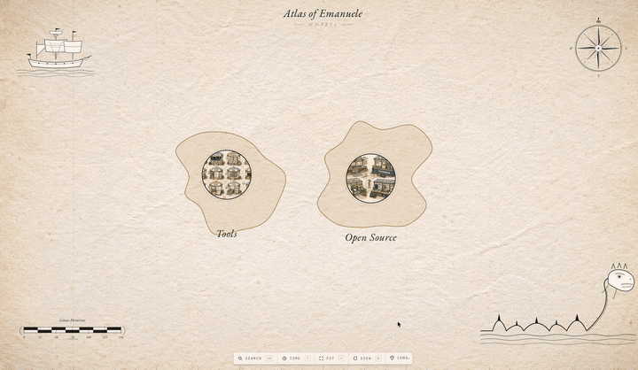

<div align="center">

# Cortex

**A knowledge-graph CLI over plain markdown, with an illustrated atlas you can fly through.**

[](LICENSE)
[](https://www.python.org/downloads/)
[](https://react.dev/)
[](#status)

[](docs/media/cortex-demo.mp4)

*Click the GIF for the full-quality MP4 walkthrough.*

</div>

---

## What is Cortex?

Cortex is a personal long-term memory system. Notes are plain markdown files that the `cortex` CLI owns end-to-end — capturing, linking, indexing, committing, and rendering into a navigable knowledge graph. A React front-end (the **Atlas**) turns that graph into an illustrated, zoomable map: scenes you fly into, hotspots you click, time you scrub.

The whole stack is designed to live alongside an AI agent (Claude Code, Codex, etc.) as the agent's *and* the human's shared memory — every state-changing command records whether the change came from a human or from an AI.

**It is built around three ideas:**

1. **Markdown is the substrate.** No database. Every note is a file you can read, grep, edit by hand, and back up with git.
2. **The CLI is the only writer.** Notes are records the CLI maintains. It commits, refreshes the index, validates wikilinks, keeps the graph internally consistent. Bypass it and you get drift.
3. **Memory should be a place.** The Atlas treats your knowledge graph as geography — domains become regions, notes become landmarks, hotspots become entrances to deeper scenes.

---

## Features

- **`cortex capture`** — quick stream-of-thought into `inbox/`, auto-titled, auto-committed.
- **`cortex write`** — structured notes with frontmatter, wikilinks, hotspots, automatic id resolution.
- **`cortex link / neighbors / backlinks / subgraph`** — typed edges across the graph; explore by hop count.
- **`cortex search`** — ranked full-text over title, tags, and body. Returns ids you can pipe into other commands.
- **`cortex ask`** — literal retrieval Q&A over the store.
- **`cortex image gen`** — illustrated scenes per note, via local `codex` or OpenAI Images. Style preset is editorial isometric on parchment.
- **`cortex atlas serve`** — boots the React Atlas locally; the CLI shells out for live JSON, no backend server needed.
- **`cortex remote create / push / pull`** — sync the memory store to a private GitHub repo across machines, with multi-account `gh` switching baked in.
- **`cortex init` auto-restores** from `<your-user>/cortex-memory` on GitHub when exactly one such repo is reachable — fresh-machine setup is one command.
- **AI authorship signal** — every state-changing command takes `--ai`; commits are tagged `AI` vs `HUMAN` so you never lose track of who wrote what.
- **Agent-ready skills** — three Claude Code skills (`cortex`, `cortex-setup`, `cortex-scan`) ship with the repo and can be symlinked into any Claude session.

---

## Architecture

```
your-machine/
├── ~/cortex/                         ← your data (configurable via $CORTEX_ROOT)
│   ├── notes/                        ← structured markdown, sibling-named hierarchy
│   ├── inbox/                        ← unstructured captures
│   ├── daily/                        ← daily logs
│   ├── assets/                       ← scene PNGs and other media
│   ├── .config/cortex.yaml           ← image provider, style preset, secrets
│   ├── .index/                       ← derived JSON for search / neighbors / atlas
│   └── .git/                         ← scoped repo, optional GitHub remote
│
└── cortex/                           ← this repo (source)
    ├── cortex-cli/                   ← Python CLI, installed via pipx
    ├── cortex-fe/                    ← React Atlas (Vite + zustand + PIXI)
    └── .claude/skills/               ← agent skills (cortex / -setup / -scan)
```

The data store at `~/cortex/` is **completely separate** from this source repo. Cloning Cortex doesn't touch your memory; uninstalling the CLI doesn't delete your notes.

---

## Install

### Prerequisites

| Tool      | Why                                              | Required? |
|-----------|--------------------------------------------------|-----------|
| Python ≥ 3.10 | the CLI runtime                              | ✅ |
| `pipx`    | installs the CLI globally without polluting deps | ✅ |
| Node.js + `npm` | builds & serves the React Atlas            | optional (only for the UI) |
| `gh`      | GitHub CLI — for remote sync and auto-restore    | optional |
| `codex` *or* OpenAI key | image generation for scenes        | optional |

### One-shot install

```bash
# (skip if you already have pipx)
python3 -m pip install --user pipx && python3 -m pipx ensurepath

git clone https://github.com/emanueleielo/cortex.git
cd cortex

# install the CLI globally (editable: source changes are live)
pipx install -e ./cortex-cli
pipx inject cortex-cli Pillow

# initialize the memory store at ~/cortex/
cortex init

# (optional) launch the Atlas
cortex atlas serve
```

If `cortex: command not found` after install, restart your shell or `source ~/.zshrc` — pipx adds `~/.local/bin` to your PATH only on first install.

### Make Cortex available to AI agents (optional)

The repo ships three Claude Code skills under `.claude/skills/`. Symlink them user-level so any Claude session — not just sessions started inside this repo — can use them:

```bash
mkdir -p ~/.claude/skills
CORTEX_SRC="$(pwd)"
for s in cortex cortex-setup cortex-scan; do
  ln -sfn "$CORTEX_SRC/.claude/skills/$s" "$HOME/.claude/skills/$s"
done
```

Symlinks (not copies) keep the skills in sync with `git pull`s.

### Configure image generation (optional)

```bash
# default: local codex CLI (sandboxed to $CORTEX_ROOT)
which codex            # if found, you're done

# alternative: OpenAI Images
cortex config set image.provider openai
cortex config set image.openai.token sk-...
```

If you have neither, image generation is silently disabled — every other command still works.

---

## Quick start

```bash
# capture a thought
cortex capture "the dispatcher pattern keeps backpressure at the queue boundary"

# write a structured note
cortex write notes/architecture/dispatcher.md \
  --title "Dispatcher pattern" \
  --tags "backend,backpressure"

# link two notes with a typed edge
cortex link dispatcher backpressure --kind explains

# explore
cortex neighbors dispatcher
cortex search "queue boundary"
cortex subgraph dispatcher --depth 2

# graph-wide stats
cortex stats

# launch the visual atlas
cortex atlas serve            # → http://localhost:5173
```

Run `cortex --help` for the full surface (28 commands).

---

## The Atlas

The React front-end at `cortex-fe/` reads your store via a Vite plugin that shells out to the `cortex` CLI on every request. There is no separate backend, no API server, no WebSocket — just the CLI, JSON, and a static dev server.

What you can do in it:

- **Pan and zoom** across an illustrated parchment of your knowledge — domains laid out as regions, notes as landmarks.
- **Click a hotspot** to dive into a child scene. Hotspots are bounding boxes drawn on the parent illustration; the Atlas resolves them to child notes by id.
- **Read a note** in-place with proper markdown, mermaid diagrams, and links to neighbors.
- **Time-scrub** with the slider to see how a region looked at any point in your note's history (drawn from git).
- **Search** instantly with fuzzy matching over titles and tags.

A demo seed (`cortex-fe/src/data/atlas.json`) ships with the repo so the Atlas is alive on a fresh clone, before you've written a single note.

---

## Sync across machines

Cortex was designed for the I-have-five-laptops case. The pattern:

```bash
# on the first machine
cortex remote create --user <your-github-user>     # creates a private cortex-memory repo and pushes
cortex remote push                                 # later, after edits

# on a fresh machine
cortex init                                        # auto-detects the cortex-memory repo on your gh accounts and restores
```

`cortex init` probes every authenticated `gh` account, finds your `cortex-memory` repo, and clones it into `~/cortex/`. If multiple accounts have one, it stops and asks rather than guessing.

---

## Status

**Beta.** The CLI surface is stable and used daily; the Atlas is feature-rich but evolving (new ornaments, new lenses, time-scrubbing improvements). Breaking changes will be called out in the changelog when they happen.

Tested on macOS (Apple Silicon and Intel) and Linux. Windows is not actively supported but the CLI should work under WSL.

---

## Contributing

Issues and pull requests are welcome. A few practical notes:

- **Skills orchestrate, the CLI implements.** If a skill needs non-trivial bash, the logic probably belongs in the CLI as a subcommand.
- **Test before declaring done.** Anything you add: at minimum, run `cortex <new-command> --help` and verify the parser is wired. For non-trivial commands, exercise one happy path.
- **No personal data in shipped artifacts.** This repo is public — README, code comments, default values, and demo seeds use generic placeholders, never real names or paths.
- **Memory operations go through the CLI.** Don't `cat` or `Write` files inside `~/cortex/` directly — the CLI commits, refreshes the index, and validates wikilinks; bypassing produces broken state.

See [`CLAUDE.md`](CLAUDE.md) for the full contributor and agent guidance.

---

## License

[Apache License 2.0](LICENSE) © 2026 Emanuele Ielo

---

<div align="center">
<sub>Built with Python, React, PIXI.js, and a stubborn belief that markdown is enough.</sub>
</div>
